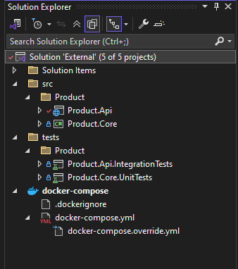
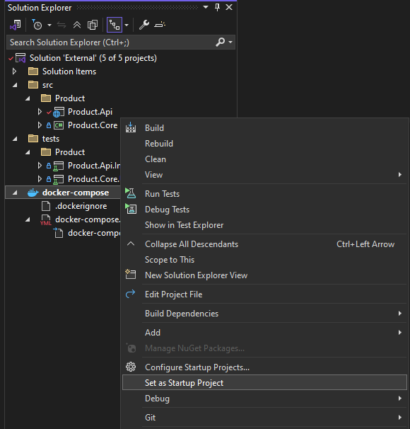
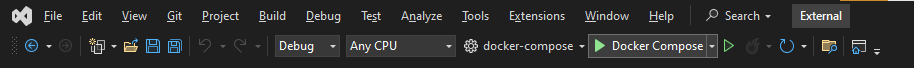
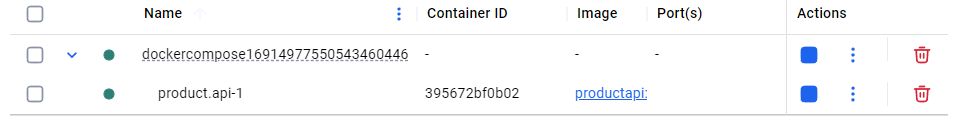
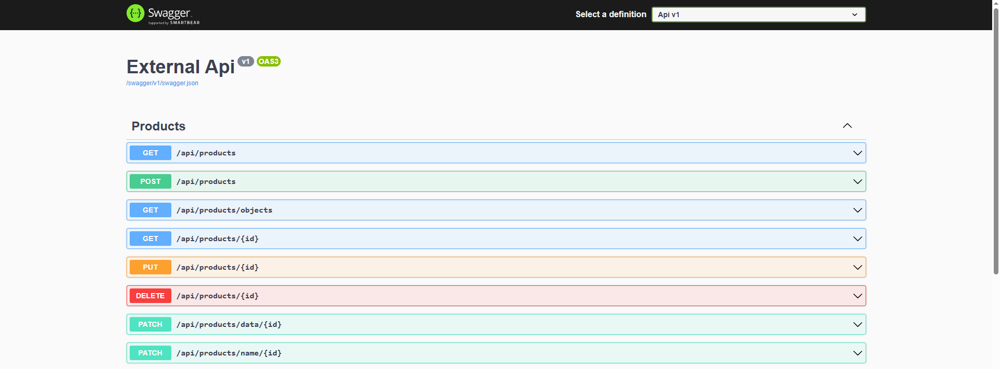
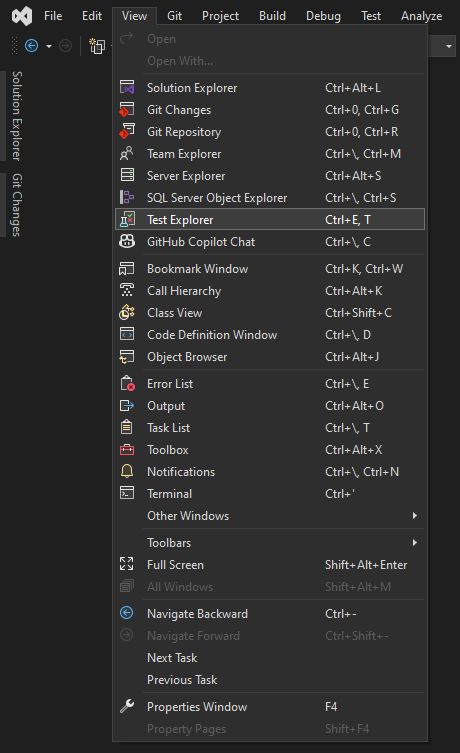
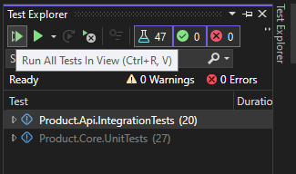

# External API App Practice

[](https://www.repostatus.org/#wip)


## Programs to Install

- [x] Docker Desktop
- [x] Git
- [x] Visual Studio 2022

## Setup Instructions

Clone the repository by navigating to your directory of choice and running the following git command `git clone https://github.com/Soup-Dumpling/external-core-api.git`.

After cloning the repository, open the `External.sln` solution file in Visual Studio. Below you can see the full `External.sln` solution opened in Visual Studio:



## Configuration

### Docker Compose

In order to run the project using Docker Compose on Visual Studio you must set the docker-compose project as a start up project and add a local file to the root directory of the project **docker-compose.override.yml** as follows:

#### Docker Compose Override

```
services:
  product.api:
    volumes:
      - ${APPDATA}/ASP.NET/Https:/root/.aspnet/https:ro

```

Make sure the Docker Compose project is set as the default startup project. Right-click on the docker-compose node in the Project Explorer, and select the _Set as StartUp Project_ menu option:



Now you can build and run the application by pressing the Debug button in the toolbar:



After the Docker container has spun up in Docker desktop, it will be displayed as follows:



Then, you can access test the project endpoints using the Swagger UI via https://localhost:5001/swagger/index.html



### Frameworks / Packages Used

| Framework / Package | Purpose                              |
| ------------------- | ------------------------------------ |
| XUnit               | Unit Testing                         |
| NSubstitute         | Fakes/Mocks/Substitutes              |
| Alba                | Integration Testing                  |
| Swashbuckle         | OpenAPI doc                          |
| Mediatr             | Mediator + Request/Response Handling |
| FluentValidation    | Validation                           |

### Core Endpoints

| Endpoint     | Purpose             |
| ------------ | ------------------- |
| /api/health  | Healthy / Unhealthy |
| /api/version | Version             |

### Environments - Product

| Environment | Url                                       |
| ----------- | ----------------------------------------- |
| Local       | https://localhost:5001/swagger/index.html |

### About each project in solution

| Project      | Description                                                           |
| ------------ | --------------------------------------------------------------------- |
| Product.Api  | Create your endpoints related to product service here                 |
| Product.Core | Core of the product service - including use cases, domain and context |

## Running the test cases

In order to run the test cases in the tests directory, click on **View -> Test Explorer** as shown below:



Once the Test Explorer panel opens, click the first green play button that runs _All Tests In View_


